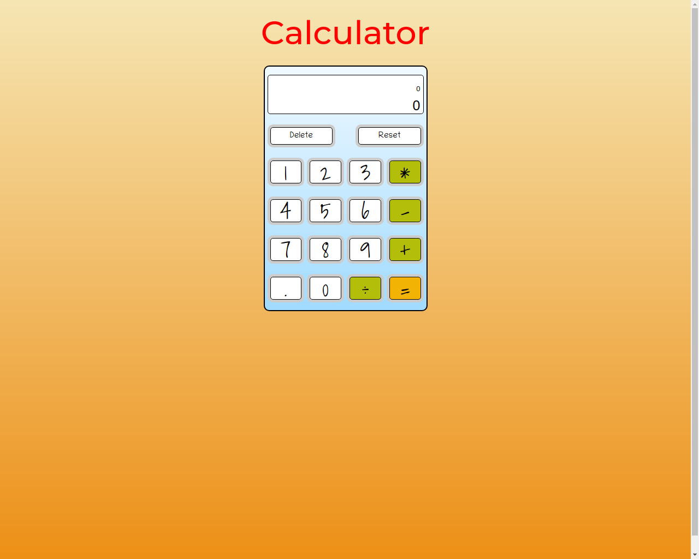

# Java Script Calculator

> This project is made as part of The Odin Project Web Dev 101 course

Basic functionality calculator

## Built With

- HTML
- CSS
- JavaScript

## Live Demo

[Live Demo Link](https://igors78.github.io/calculator/)

## Getting Started

**You can use calculator from any browser via the link above**

## Authors

👤 **Author1**

- GitHub: [@githubhandle](https://github.com/Igors78)
- Twitter: [@twitterhandle](https://twitter.com/oleinikovs)
- LinkedIn: [LinkedIn](https://www.linkedin.com/in/igors-oleinikovs-17a10958/)

## Show your support

Give a ⭐️ if you like this project!

## 📝 License

This project is [MIT](./license.txt) licensed.
